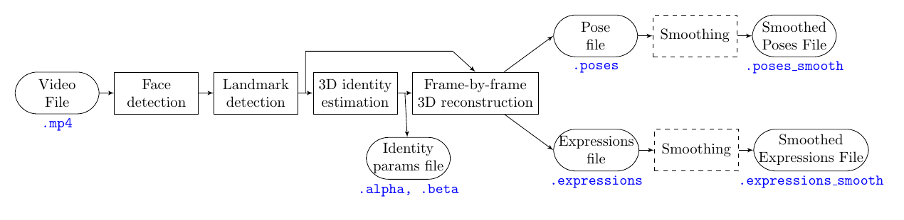

## Introduction

<p align="center">
 
</p>
Repository of the 3DI method for 3D face reconstruction via 3DMM fitting. The implementation is based on CUDA programming and therefore requires an NVIDIA GPU. Below we explain the how to install and run this implementation.

### Table of contents: 
1. [Requirements](#requirements)
1. [Installation](#installation)
1. [Running the code](#running-the-code)
1. [Output format](#output-formats)
1. [Advanced features](#advanced-features)
	1. [Camera Calibration](#camera-calibration)

***

# Requirements
***
**Models**
* Basel Face Model (BFM'09): [click here](https://faces.dmi.unibas.ch/bfm/index.php?nav=1-2&id=downloads) to obtain the Basel Face Model from the University of Basel
* Expression Model: Download the expression model (the Exp_Pca.bin) file from [this link](https://github.com/Juyong/3DFace)

**Software**
* CUDA (tested with v11.0)
* OpenCV (tested with v4.5)
* Python 3

The following python packages are also needed, but these can be installed by following the instructions in Section 2 of Installation below.
* cvxpy (for temporal smoothing via post-processing)
* scikit-learn
* matplotlib
* opencv-python

# Installation
***


### 1) Compile CUDA code
Clone the git repository 
```
git clone https://github.com/Computational-Psychiatry/3DI.git
```
and compile the CUDA code as below

```
cd build 
chmod +x builder.sh
./builder.sh
```

### 2) Install python packages

Install the necessary packages via pip. It is advised to use a virtual environment by running and update pip
```
cd build
python3 -m venv env
source env/bin/activate
pip install --upgrade pip
```

The necessary packages can simply be installed by running.

```
pip install -r requirements.txt
```

### 3) Pre-process Morphable Models

Make sure that you downloaded the Basel Face Model (`01_MorphableModel.mat`) and the Expression Model (`Exp_Pca.bin`) as highlighted in the Requirements section above. Then, copy these model files into the `build/models/raw` directory. Specifically, these files should be in the following locations:
```
build/models/raw/01_MorphableModel.mat
build/models/raw/Exp_Pca.bin
```

Then run the following python script to adapt these models to the 3DI code:
```
cd build/models
python3 prepare_BFM.py
```

Also, you need to unpack the landmark models etc. in the same directory
```
tar -xvzf lmodels.tar.gz
```

# Running the code
***

### Quickstart
Go to the `build` directory and, if you used a virtual environment, activate it by running `source env/bin/activate`. Then, the following is an example command (will produce visuals as well)
```
python process_video.py ./output testdata/elaine.mp4
```
The produced files are in the subdirectory created under the `output` directory. The file with expression parameters has the extension `.expressions_smooth` and the pose parameters have the extension `.poses_smooth`. The script above takes approximately 6 minutes to run, and this includes the production of the visualization parameters as well as temporal smoothing. Some tips to reduce total processing time:
* *Visualization* (i.e., production of rendering videos) can be disabled by passing the parameter `--produce_3Drec_videos=False`.
* *Temporal smoothing* can be disabled by passing the parameter `--smooth_pose_exp=False`
* The reconstruction can be sped up by passing the parameter `--cfgid=2` to use the 2nd configuration file, which is faster although results will include more jitter


If you want to compute local expression basis coefficients (experimental), you can run: 
```
python process_video.py ./output testdata/elaine.mp4 --compute_local_exp_coeffs=True
```

More parameters can be seen by running 
```python process_video.py --help```

The `process_video.py` script does a series of pre- and post-processing for reconstruction (details are in the section below). It is important to know that we **first estimate the identity parameters** of the subject in the video, by using a small subset of the video frames, and then we compute pose and expression coefficients at every frame. Thus, the identity parameters are held common throughout the video.


### Details of video processing


The `process_video.py` script does a series of processes on the video. Specifically, it does the following steps in this order:
1. Face detection on the entire video
1. Facial landmark detection on the entire video
1. 3D (neutral) identity parameter estimation via 3DI (using a subset of frames from the videos)
1. Frame-by-frame 3D reconstruction via 3DI (identity parameters are fixed here to the ones produced in the previous step)
1. (Optional) Temporal smoothing
1. (Optional) Production of 3D reconstruction videos 
1. (Optional) Production of video with 2D landmarks estimated by 3DI

The first four steps are visualized below; the blue text indicates the extension of the corresponding files



The 2D landmarks estimated by 3DI are also produced optionally based on the files produced above.


# Output formats

Below are the extensions some of the output files provided by 3DI video analysis software:
* `.expressions_smooth`: A text file that contains all the expression coefficients of the video. That is, the file contains a `Tx79` matrix, where the `t`th row contains the 79 expression coefficients of the expression (PCA) model
* `.poses_smooth`: A text file that contains all the poses coefficients of the video. The file contains a `Tx9` matrix, where the **first 3 columns** contain the the 3D translation `(tx, ty, tz)` for all the `T` frames of the video and the **last 3 columns** of the matrix contain the rotation (`yaw, pitch, roll`) for all the `T` frames.
* `.local_exp_coeffs.*` (requires `--compute_local_exp_coeffs=True`): Localized expression coefficients for the video; a text file that contains `TxK` entries, where `K` is the number of coefficients of the basis that is used to compute the expressions. See [video here](https://youtu.be/gKe8kU0kbN4) for an illustration of to what each coefficient corresponds to (e.g., the 25th coefficient in this text file indicates activation in the 25th basis component in the video).
* `.2Dlmks`: A text file with the 51 landmarks corresponding to the inner face (see below), as predicted by 3DI. The file contains a matrix of size `Tx102`, where each row is of the format: `x0 y0 x1 y1 ... x51 y50`.
* `.canonicalized_lmks`: A text file with the 51 landmarks corresponding to the inner face (see below), after removing identity and pose variation. The file contains a matrix of size `Tx153`, where each row is of the format: `x0 y0 z0 x1 y1 z1 ... x50 y50 z50`.


The following are the relative IDs of the landmarks corresponding to each facial feature:
```
{'lb': [0, 1, 2, 3, 4], # left brow
 'rb': [5, 6, 7, 8, 9], # right brow
 'no': [10, 11, 12, 13, 14, 15, 16, 17, 18], # nose
 'le': [19, 20, 21, 22, 23, 24], # left eye
 're': [25, 26, 27, 28, 29, 30], # right eye
 'ul': [31, 32, 33, 34, 35, 36, 43, 44, 45, 46], # upper lip
 'll': [37, 38, 39, 40, 41, 42, 47, 48, 49, 50]} # lower lip
```
# Computation time

The processing of a video has a number of steps (see [Running the code](#running-the-code)), and the table below lists the computation time for each of these. We provide computation time for two different configuration files (see `cfgid` [above](#running-the-code)). The default configuration file (`cfgid=1`) leads to significantly less jitter in the results but to also longer processing times, whereas the second one (`cfgid=2`) works faster but yields more jittery videos. 

Note that the main script for videos (`process_video.py`) includes a number of optional steps like post smoothing and visualization. These can be turned off using the parameters outlined at the section [Running the code](#running-the-code).

### Average processing times
<table>
        <tr><th></th><th>Config. 1</th><th> Config. 2</th><td>Time unit</td></tr>
    <tbody>
        <tr><td>Face detection<sup>&#8224;</sup></td>	<td colspan=2 style="text-align:center;">18.83</td><td>ms per frame</td></tr>
        <tr><td>Landmark detection<sup>&#8224;</sup></td>	<td colspan=2 style="text-align:center;">137.92</td><td>ms per frame</td></tr>
        <tr><td>Identity learning<sup>&#8224;</sup></td>	<td>95542</td><td>62043</td><td>ms per <em>video</em></td></tr>
        <tr><td>3D reconstruction<sup>&#8224;</sup></td>	<td>331.72</td><td>71.27</td><td>ms per frame</td></tr>
        <tr><td>Smoothing</td>		<td colspan=2 style="text-align:center;">82.84</td><td>ms per frame</td></tr>
        <tr><td>Production of 3D reconstruction videos</td>	<td colspan=2 style="text-align:center;">199.35</td><td>ms per frame</td></tr>
        <tr><td>Production of 2D landmark videos</td>		<td colspan=2 style="text-align:center;">32.70</td><td>ms per frame</td></tr>
    </tbody>
</table>
<p style="font-size:85%"><sup>&#8224;</sup>Required step</p>


# Advanced features

## Camera Calibration

### Creating the calibration data
The performance of 3DI is expected to improve if one incorporates the matrix of the camera that was used to record the data into the reconstruction process. We provide a calibration procedure, outlined below. (The procedure is for a camera of a MacBook Pro 21, you may replace the strings `macbookpro21` with your camera model wherever applicable.)

1. Print the checkerboard pattern in the following link to an letter- or A4-sized paper: https://github.com/opencv/opencv/blob/4.x/doc/pattern.png (the pattern is also in this repository at `./build/models/cameras/pattern.png`)
1. Tape the printed checkerboard pattern to a sturdy surface, like a clipboard. Make sure that the paper is taped tightly and neatly.
1. Record a video of yourself while holding the chechkerboard pattern at various angles and distances. An example video can be found in the following link:  https://www.youtube.com/watch?v=z0nQGeVJS3s
	* Make sure that you move slowly to minimize motion blur
	* Try to keep the checkerboard pattern within the frame at all times
	* Try to have a video of 2-3 minutes --- not much shorter or longer
1. Create the directory `build/calibration/videos`:
	* `mkdir build/calibration/videos`
1. Copy your video inside the folder `build/calibration/videos`. In the rest of this tutorial, we assume that the video file is at the following location: `build/calibration/videos/macbookpro21.mp4`
1. Go to the `build` directory: `cd build`
1. Create directories through the following comments:
	* `mkdir calibration/videos/frames`
	* `mkdir calibration/videos/frames/macbookpro21`
1. Create frames from the video by running the following `ffmpeg` command:
	* `ffmpeg -i calibration/videos/macbookpro21.mp4 -r 1 calibration/videos/frames/macbookpro21/frame%04d.png`	
1. Manually inspect the images in the directory `calibration/videos/frames/macbookpro21/`. Remove any images where there is too much motion blur or the checkerboard is not fully in the frame. 
1. Now we will do the calibration. 
	* Make sure that the you successfully completed the installation by following the steps in the Installation section
	* Run the following command from the `build` directory:
		* `./calibrate_camera "calibration/videos/frames/macbookpro21/frame*.png" "models/cameras/macbookpro21.txt"`
	* The code above can take a few minutes
	* The code may need a GUI to run, but this can easily be fixed (you can comment out the `imread`'s within the `camera.h` file that cause the need for GUI and re-compile the code)
1. The If the code runs successfully, your calibration file must be located at `build/models/cameras/macbookpro21.txt`.

### Using the calibration matrix
Once you obtained the calibration matrix, it can be incorporated into the reconstruction process by using two additional command line arguments, namely `camera_param` and `undistort`. The former argument be set to the camera calibration file and the latter to `1`, as shown below:

```
python process_video.py ./output testdata/elaine.mp4 --camera_param=./models/cameras/macbookpro21.txt --undistort=1
```

(This command is for illustration only, since the `elaine.mp4` video was clearly not recorded with a MacBook Pro.)


